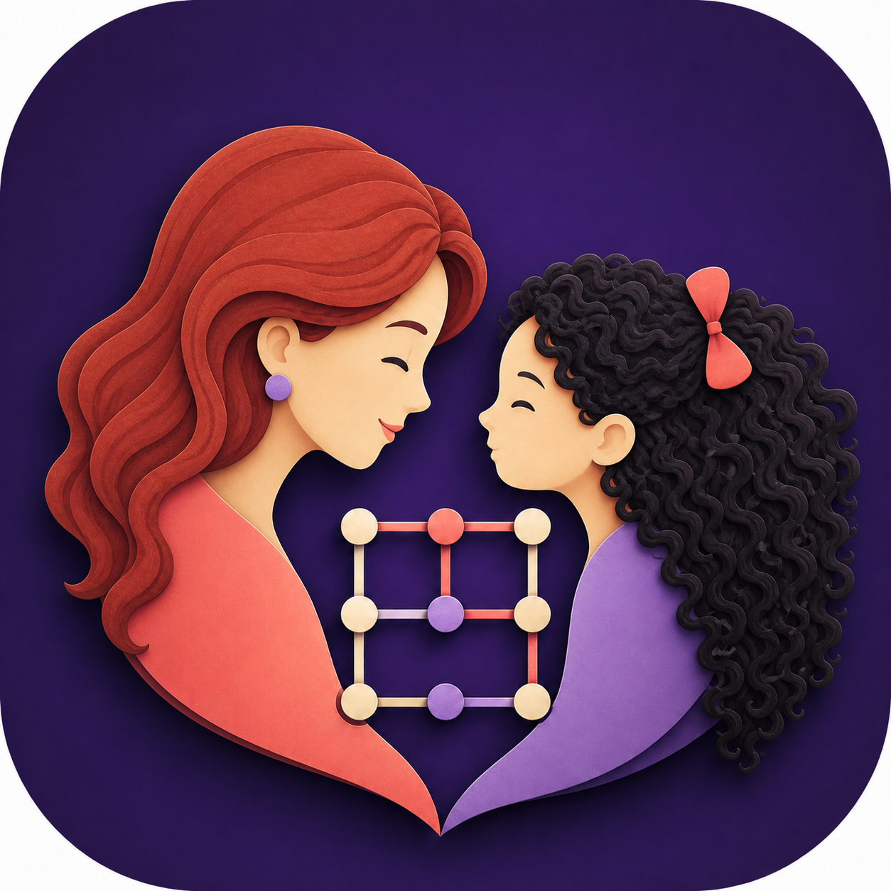

# Timbiriche con Tutu

<p align="center">
  
</p>

<p align="center">
  Un juego familiar de puntos y cuadros para compartir momentos, en el mismo dispositivo o a distancia.
</p>

## Acerca del proyecto

**Timbiriche con Tutu** transforma el clásico juego de puntos y cuadros en una experiencia cálida, colorida y accesible. Fue diseñado para que Tutu y su familia puedan jugar desde una tableta Windows, un celular o dos dispositivos conectados mediante una sala privada.

Esta versión 2.0 reemplaza la implementación original en Python con una aplicación Flutter multiplataforma y una interfaz completamente renovada.

## Características

- Juego local para dos personas que se turnan en un mismo dispositivo.
- Salas en línea sincronizadas con Firebase Realtime Database.
- Guardado automático para continuar una partida posteriormente.
- Interfaz adaptable para celulares y tabletas Windows, en vertical u horizontal.
- Tablero de 6 × 6 cuadros con líneas de alto contraste.
- Mensajes, sonido y explosión de confeti al completar un cuadro.
- Mariposas animadas y lluvia de globos multicolores al finalizar.
- Música ambiental opcional.
- Compatibilidad preparada para Android, iOS y Windows.

## Experiencia visual

La identidad utiliza una paleta violeta, coral y turquesa. El icono representa a Tutu y su compañera de juego unidas por el tablero. Las animaciones celebran cada jugada sin bloquear las áreas táctiles.

## Tecnologías

- Flutter y Dart
- Material 3
- Provider para estado reactivo
- Firebase Core y Realtime Database
- Shared Preferences para persistencia local
- Audioplayers y Confetti para efectos multimedia

## Estructura principal

```text
lib/
├── app_theme.dart        # Colores, tipografía y componentes visuales
├── game_logic.dart       # Reglas, turnos, puntuación y serialización
├── game_grid.dart        # Tablero interactivo adaptable
├── game_screen.dart      # Experiencia principal y modos de juego
├── game_storage.dart     # Guardado y recuperación local
├── firebase_service.dart # Sincronización de salas
└── magic_effects.dart    # Mariposas y efectos animados
```

## Instalación

Requisitos:

- Flutter con Dart 3.10 o posterior.
- Visual Studio con “Desktop development with C++” para Windows.
- Android Studio o un dispositivo Android para compilar el APK.

```bash
git clone https://github.com/ClaFlorez/Timbiriche.git
cd Timbiriche
flutter pub get
```

### Configuración de Firebase

El repositorio contiene únicamente la configuración pública de cliente necesaria para compilar. Para conectar una bifurcación a otro proyecto Firebase:

```bash
dart pub global activate flutterfire_cli
flutterfire configure
```

El modo **Jugar juntas** funciona localmente sin iniciar una sala.

## Ejecución

Windows:

```bash
flutter run -d windows
```

Android conectado:

```bash
flutter devices
flutter run -d <ID_DEL_DISPOSITIVO>
```

Generar un APK:

```bash
flutter build apk --release
```

## Calidad

```bash
flutter analyze
flutter test
```

La suite cubre la restauración de partidas, la última caja del tablero y diseños de celular y tableta Windows.

## Privacidad

La aplicación no solicita cuentas, correos electrónicos ni perfiles personales. Las partidas en línea se identifican mediante un código de sala compartido entre las personas participantes.

## Créditos y herramientas

Este proyecto fue creado y desarrollado con apoyo de herramientas de inteligencia artificial: **OpenAI Codex**, **Antigravity** y **Google Gemini**. La imagen y su composición visual se trabajaron con **Canva** junto con **Gemini**.

## Estado

Versión actual: **2.0.0**

Consulta [CHANGELOG.md](CHANGELOG.md) para ver el historial detallado.

Consulta [PROBLEMAS_ENCONTRADOS.md](PROBLEMAS_ENCONTRADOS.md) para resolver los problemas conocidos de compilación y distribución en Windows y Android.

---

Diseñado con cariño por **claud·IA**.
